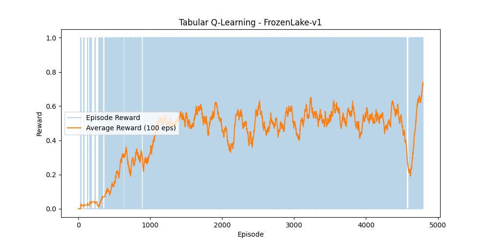
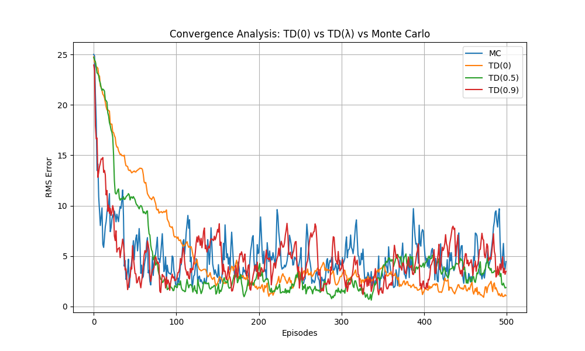
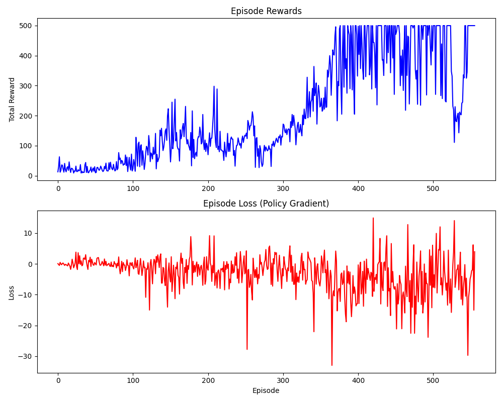
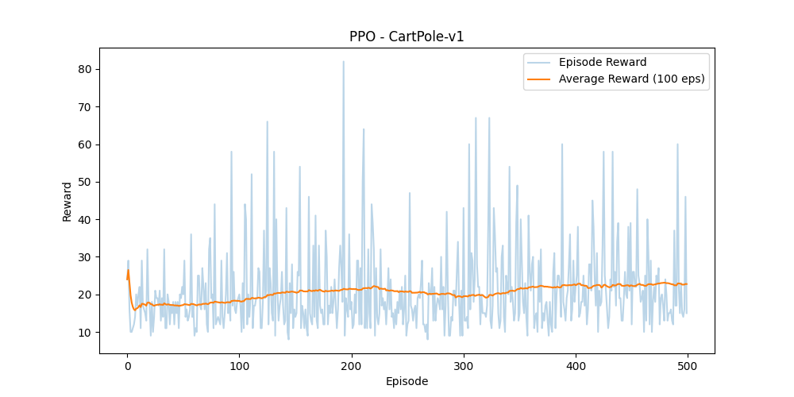

# Reinforcement Learning

A clean, growing workspace for implementing and experimenting with reinforcement learning algorithms from scratch.

---

## Overview

This project implements core RL algorithms step-by-step — from classic tabular methods to deep neural-network-based agents — tested on standard Gymnasium environments. Each algorithm is self-contained and documented with results.

---

## Getting Started

### Prerequisites

- macOS with [pyenv](https://github.com/pyenv/pyenv) installed
- Python 3.10.18 via pyenv (`pyenv install 3.10.18`)
- [Homebrew](https://brew.sh/) and `swig` (`brew install swig`) — required for Box2D environments

### Setup

```bash
# 1. Create virtual environment
pyenv virtualenv 3.10.18 spinningup-env
pyenv local spinningup-env      # writes .python-version

# 2. Upgrade pip & build tools
pip install --upgrade pip setuptools wheel

# 3. Install PyTorch (CPU)
pip install torch torchvision --index-url https://download.pytorch.org/whl/cpu

# 4. Install Gymnasium with extras
pip install "gymnasium[classic-control,box2d]"

# 5. Clone and install firedup (Spinning Up — PyTorch port)
git clone https://github.com/kashif/firedup.git spinningup
pip install --no-deps -e ./spinningup
pip install scipy matplotlib seaborn pandas ipython joblib tqdm psutil mpi4py

# 6. Verify
python -c "import fireup; import gymnasium; import torch; print('OK')"
```

> **Note:** `--no-deps` prevents firedup pulling in the old `gym` + `box2d-py`. Gymnasium 1.x is already installed and compatible.

### Activating the environment

The `.python-version` file makes pyenv automatically use `spinningup-env`. Manual activation:

```bash
pyenv activate spinningup-env
```

---

## Project Structure

```
reinforcement-learning/
├── algorithms/
│   ├── bandit/          # K-Armed Bandit agents (Epsilon-Greedy, UCB)
│   ├── dqn/             # Deep Q-Network implementations
│   ├── vpg/             # Vanilla Policy Gradient
│   ├── ppo/             # Proximal Policy Optimization
│   └── td_vs_mc/        # TD(0) vs Monte Carlo comparison
├── envs/
│   ├── bandit/          # K-Armed Bandit environment
│   └── gridworld/       # Custom GridWorld environments + FrozenLake Q-Learning
├── models/              # Saved model checkpoints (gitignored)
│   └── dqn/
│       └── mountaincar/ # policy_ep<N>_<timestamp>.pt
├── utils/
│   └── replay_buffer.py # Shared experience replay buffer
├── spinningup/          # Firedup source (gitignored)
└── tests/
```

---

## Implemented Algorithms

### 1. K-Armed Bandit — `algorithms/bandit/`

**Environment:** Custom 10-Armed Bandit — `envs/bandit/k_armed_bandit.py`

Two exploration strategies compared over 2,000 independent runs on a stationary testbed:

| Agent | Strategy |
|---|---|
| Epsilon-Greedy | Explores uniformly at random with probability ε = 0.1 |
| UCB | Selects based on upper confidence bound with c = 2.0 |

**Result:**


UCB outperforms Epsilon-Greedy over time because it explicitly tracks uncertainty per arm and naturally stops exploring arms that are definitively suboptimal. Epsilon-Greedy continues random exploration indefinitely regardless of knowledge gained.

---

### 2. Tabular Q-Learning — `envs/gridworld/`

**Environments:**
- Custom `GridWorld` — `gridworld_basic.py` / `gridworld_gym.py`
- `FrozenLake-v1` — `frozen_lake_q_learning.py`

Classic tabular Q-Learning with epsilon-greedy exploration on discrete grid environments. Demonstrates the foundations of value-based RL before scaling to neural networks.

**FrozenLake Result:**



---

### 3. TD(0) vs Monte Carlo — `algorithms/td_vs_mc/compare.py`

**Environment:** Custom GridWorld

A direct comparison of two fundamental prediction methods:

| Method | Update Rule |
|---|---|
| Monte Carlo | Updates from full episode returns — high variance, no bias |
| TD(0) | Bootstraps from the next state — lower variance, biased |

**Result:**



---

### 4. Deep Q-Network (DQN) — `algorithms/dqn/`

A DQN implementation with:
- Experience Replay (`utils/replay_buffer.py`)
- Separate Target Network (synced every N episodes)
- Huber loss (robust to large TD-errors)
- Gradient clipping
- Reward shaping

#### 4a. CartPole — `cartpole_dqn.py`

**Environment:** `CartPole-v1`

| Hyperparameter | Value |
|---|---|
| Batch Size | 64 |
| γ (Gamma) | 0.99 |
| ε decay | 0.995 |
| LR | 1e-3 |
| Memory | 10,000 |

**Result:**


The agent successfully learns to balance the pole, achieving the maximum score of 500 consistently. The loss does not monotonically decrease — this is expected in DQN due to moving targets and bootstrapping from new states as the agent survives longer.

#### 4b. MountainCar — `mountaincar_dqn.py`

**Environment:** `MountainCar-v0` — a notoriously hard sparse-reward problem. The car must build kinetic energy by oscillating back and forth; the native reward is always −1 until reaching the flag.

| Hyperparameter | Value |
|---|---|
| Batch Size | 128 |
| γ (Gamma) | 0.99 |
| ε decay | 0.995 |
| LR | 1e-3 |
| Memory | 50,000 |
| Episodes | 2,000 |

**Reward Shaping** (breaks the sparse reward problem):

```python
velocity_bonus = abs(velocity) * 10          # encourage building speed
position_bonus = (position + 1.2) ** 2       # quadratic pull toward the flag
goal_bonus     = 50.0 if terminated else 0.0 # explicit success signal
shaped_reward  = reward + velocity_bonus + position_bonus + goal_bonus
```

**Result:**


The agent solved the environment (consistently reaching reward ≥ −110) around episode ~1,116, achieving test rewards in the range of **−88 to −107** across multiple evaluation runs.

**Train / Test CLI:**

```bash
# Train a new agent (automatically saves to models/dqn/mountaincar/)
python algorithms/dqn/mountaincar_dqn.py --mode train

# Test the latest saved agent
python algorithms/dqn/mountaincar_dqn.py --mode test

# Test a specific checkpoint
python algorithms/dqn/mountaincar_dqn.py --mode test --model-path models/dqn/mountaincar/policy_ep1116_20260405_171435.pt
```

Checkpoints are saved as `models/<algorithm>/<environment>/policy_ep<N>_<YYYYMMDD_HHMMSS>.pt`. When no `--model-path` is given, the most recent `.pt` file is loaded automatically.

---

### 5. Vanilla Policy Gradient (VPG) — `algorithms/vpg/cartpole_vpg.py`

**Environment:** `CartPole-v1`

A policy-gradient implementation using REINFORCE with a learned baseline. Directly optimises the policy parameters using gradient ascent on the expected return.

**Result:**



---

### 6. Proximal Policy Optimization (PPO) — `algorithms/ppo/cartpole_ppo.py`

**Environment:** `CartPole-v1`

An actor-critic PPO implementation with:
- Generalised Advantage Estimation (GAE)
- Clipped surrogate objective (clip ε = 0.2)
- Separate actor and critic networks
- Multiple update epochs per rollout

**Result:**



---

## Compatibility Notes

| Component | Version |
|---|---|
| Python | 3.10.18 (via pyenv) |
| Gymnasium | 1.2.3 |
| PyTorch | 2.x (CPU or MPS on Apple Silicon) |
| Firedup (Spinning Up) | kashif/firedup — PyTorch port |
| MuJoCo | Not installed |

> Apple Silicon (MPS) is automatically detected and used if available. Falls back to CPU.

---