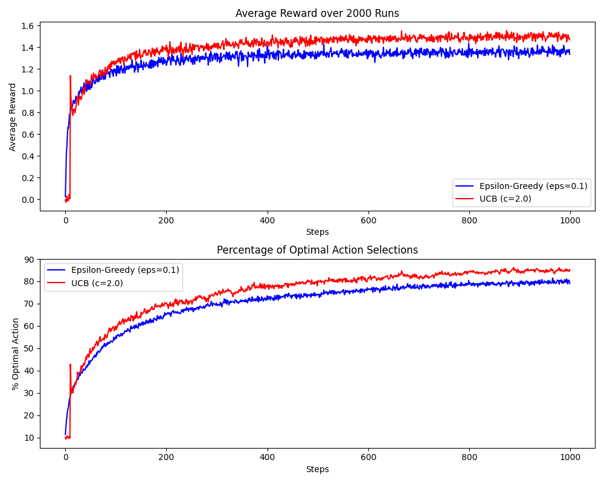
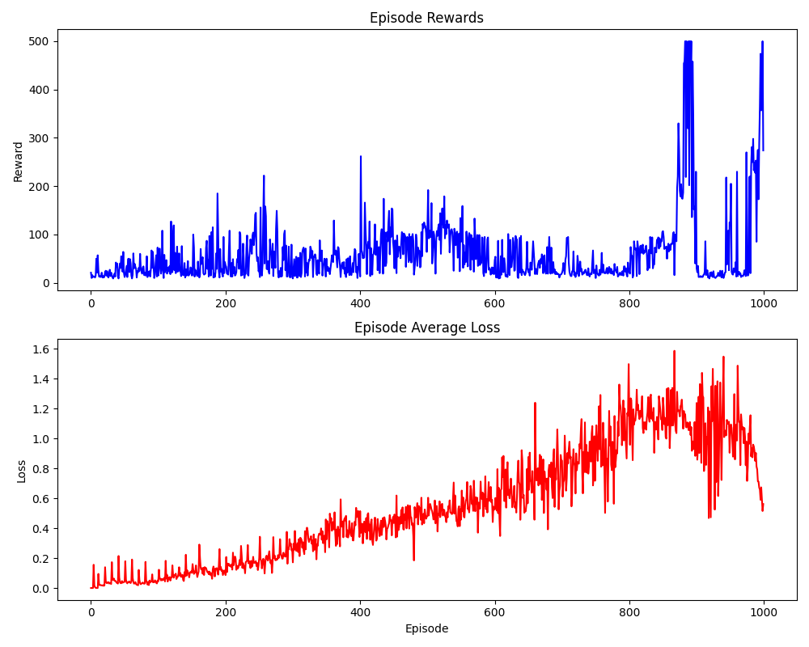

# Reinforcement Learning

A clean workspace for reinforcement learning algorithms and experiments.

## Overview

This project is dedicated to implementing and testing various Reinforcement Learning (RL) techniques. It uses **fireup** (kashif's PyTorch port of OpenAI Spinning Up) as the core algorithm library.

**Included algorithms:** VPG, PPO, TRPO, DDPG, TD3, SAC

## Getting Started

### Prerequisites

- macOS with [pyenv](https://github.com/pyenv/pyenv) installed
- Python 3.10.18 available via pyenv (`pyenv install 3.10.18`)
- [Homebrew](https://brew.sh/) and `swig` (`brew install swig`) — required for Box2D environments

### Setup

#### Step 1 — Create the virtual environment

```bash
pyenv virtualenv 3.10.18 spinningup-env
pyenv local spinningup-env   # writes .python-version
```

#### Step 2 — Upgrade pip & install build tools

```bash
pip install --upgrade pip setuptools wheel
```

#### Step 3 — Install PyTorch (CPU)

```bash
pip install torch torchvision --index-url https://download.pytorch.org/whl/cpu
```

#### Step 4 — Install Gymnasium with extras

```bash
pip install "gymnasium[classic-control,box2d]"
```

#### Step 5 — Clone and install firedup (Spinning Up)

```bash
git clone https://github.com/kashif/firedup.git spinningup
pip install --no-deps -e ./spinningup
pip install scipy matplotlib seaborn pandas ipython joblib tqdm psutil mpi4py
```

> **Note:** We use `--no-deps` to avoid pulling in the old `gym` + `box2d-py` that firedup's setup.py requests. Gymnasium 1.x is already installed and compatible.

#### Step 6 — Verify installation

```bash
python -c "import fireup; import gymnasium; import torch; print('OK')"
```

### Running an algorithm

Train PPO on CartPole for 50 epochs:

```bash
python -m fireup.algos.ppo.ppo --env CartPole-v1 --epochs 50 --cpu 1
```

Train VPG on LunarLander (Box2D):

```bash
python -m fireup.algos.vpg.vpg --env LunarLander-v3 --epochs 100 --cpu 1
```

Train SAC on a continuous control environment:

```bash
python -m fireup.algos.sac.sac --env Pendulum-v1 --epochs 50
```

### Activating the environment

The `.python-version` file in the project root makes pyenv automatically use `spinningup-env`. You can also activate manually:

```bash
pyenv activate spinningup-env
```

## Project Structure

- `spinningup/` — Firedup source (gitignored, cloned from kashif/firedup)
- `src/` — Custom algorithm implementations
- `envs/` — Custom environment definitions
- `notebooks/` — Exploration and visualization
- `tests/` — Unit and integration tests

## Implemented Content

### Custom Algorithms
- **DQN with Replay Buffer & Target Network**: Implemented in `algorithms/dqn/cartpole_dqn.py`. It uses a custom `ReplayBuffer` located in `utils/replay_buffer.py`.
- **Epsilon-Greedy Q-Learning**: Implemented for custom GridWorld navigation.

### Custom Environments
- **Basic GridWorld**: A discrete 2D grid environment in `envs/gridworld/gridworld_basic.py`.
- **Gymnasium-Compatible GridWorld**: A standard Gym wrapper for the GridWorld environment located in `envs/gridworld/gridworld_gym.py`.

### Classic Problems
- **K-Armed Bandit**: A generalized 10-armed testbed environment (`envs/bandit/k_armed_bandit.py`) with standard Epsilon-Greedy and UCB (Upper Confidence Bound) algorithms (`algorithms/bandit/agents.py`).

### Results

**Multi-Armed Bandit Comparison (UCB vs Epsilon-Greedy)**


*Explanation:*
The plot above demonstrates the performance of an Epsilon-Greedy agent ($\epsilon=0.1$) against a UCB agent ($c=2.0$) over 2,000 independent runs on an initially stationary 10-armed bandit testbed. UCB generally outperforms epsilon-greedy over time because it explicitly tracks uncertainties and naturally stops exploring arms that are definitively proven to be suboptimal, whereas $\epsilon$-greedy explores uniformly randomly forever.

**CartPole DQN Training Results**


*Explanation:* 
As seen in the plot above, the agent successfully learns to maximize the episodic reward across 1000 episodes, achieving the maximum score of 500 for CartPole-v1. 

You may notice that the **Episodic Average Loss** does not smoothly decrease like it does in standard supervised learning. This is an expected characteristic of Deep Q-Learning due to:
1. **Moving Targets:** The target network weights update periodically, causing sudden shifts in the expected values and triggering temporary spikes in the loss.
2. **Bootstrapping and State Distribution:** As the agent survives longer, it encounters completely new, unfamiliar states with high initial Temporal Difference (TD) errors. The magnitude of predicted returns also scales up.

In Reinforcement Learning, the **Episodic Reward** is the ultimate measure of convergence and performance, rather than the loss.

## Compatibility Notes

- **Library:** `kashif/firedup` (PyTorch port) — not the original `openai/spinningup` (broken on Python 3.8+)
- **Python:** 3.10.18 via pyenv
- **Gymnasium:** 1.2.3 (modern fork of OpenAI Gym)
- **PyTorch:** 2.10.0 (CPU build)
- **MuJoCo:** Not installed. Classic-control and Box2D environments are fully supported.

## License

MIT
